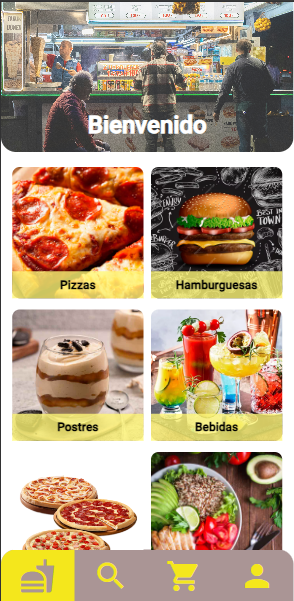
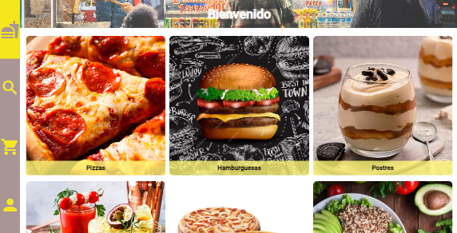
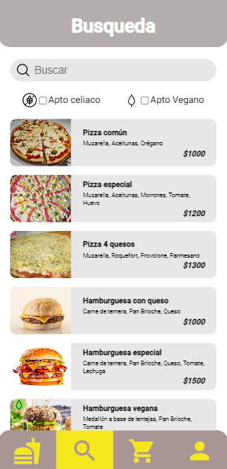
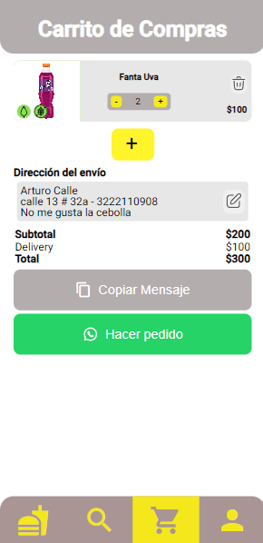
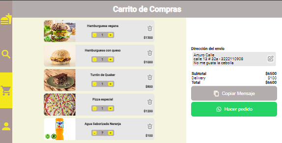
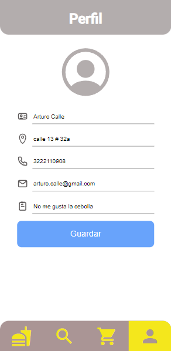
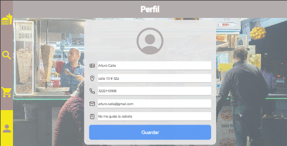
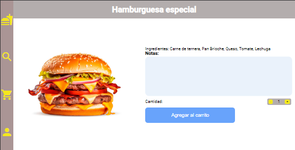

# DelishGo

Este es un proyecto que modela el funcionamiento de una aplicación de comidas con pedidos a domicilio mediante whatsapp. Cuenta con página de productos o home, página de busqueda, página para el carrito y además cuenta con una página del perfil del usuario.
Fue desarrollado con la ayuda y guía de [Calo](https://github.com/cacalo) del canal de YouTube [PuntoJson](https://www.youtube.com/@puntojson).

Esta aplicación web fue generada con [Angular CLI](https://github.com/angular/angular-cli) version 16.2.13. Además tiene un patrón de diseño basado en componentes.

## Construir

Ejecute `ng build` para construir el proyecto. Los artefactos de compilación se almacenarán en el directorio `dist/`.

## Ejecución

Abra la carpeta donde se encuentra el proyecto mediante la terminal y ejecute `ng serve`.
 
Luego abra el navegador y ponga la siguiente dirección `http://localhost:4200/`. La aplicación se recargará automáticamente si cambia alguno de los archivos fuente.

## Screens

### Screen del home o página de inicio

 

### Screen de la página de busqueda

### Screen de la página del carrito
 

### Screen de la página de perfil
 

### Badges
     
